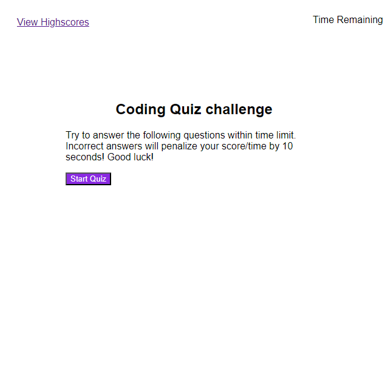

# Code-Quiz-Challenge-4

## Description

With the goal of having a quiz to test my knowledge of coding, I created a Code Quiz. I created a start button that when clicked, started a timer and displayed a series of questoins. When I answer was click, a new quetion was displyed. A 10 second penalty was assesed for incorrect answers. When the quiz was completed, a final score was displyed. The user coudl then input intials to have that socre recorded on the High Scores page. 

## Installation

N/A

## Usage

https://github.com/ericolson1977/Code-Quiz-Challenge-4

https://ericolson1977.github.io/Code-Quiz-Challenge-4/

## Credits

N/A

## License

Please refer to the LICENSE in the repo.

---